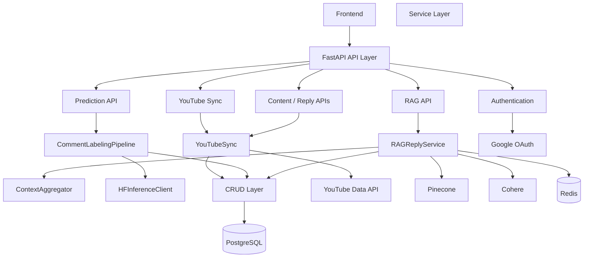
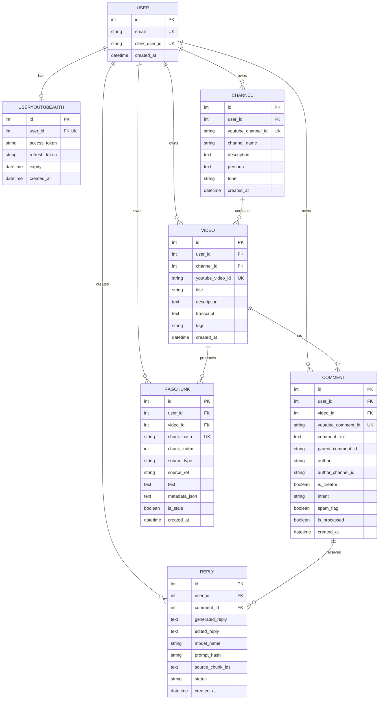
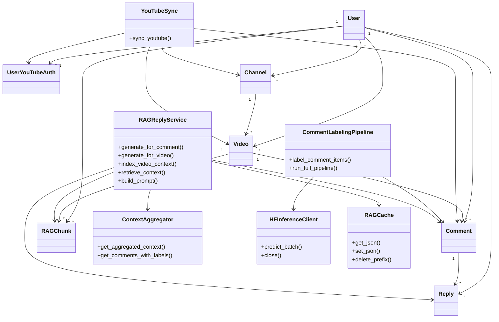
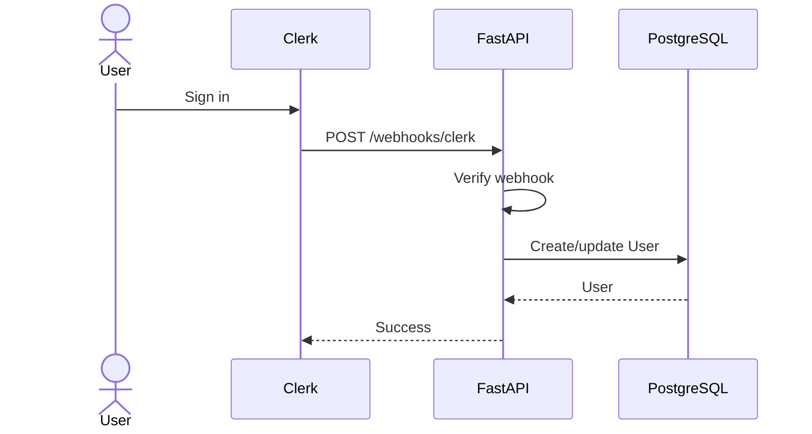
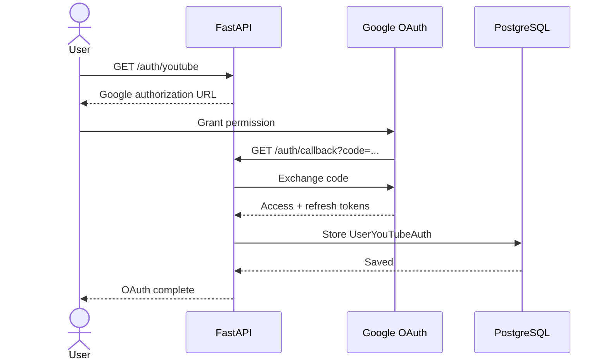
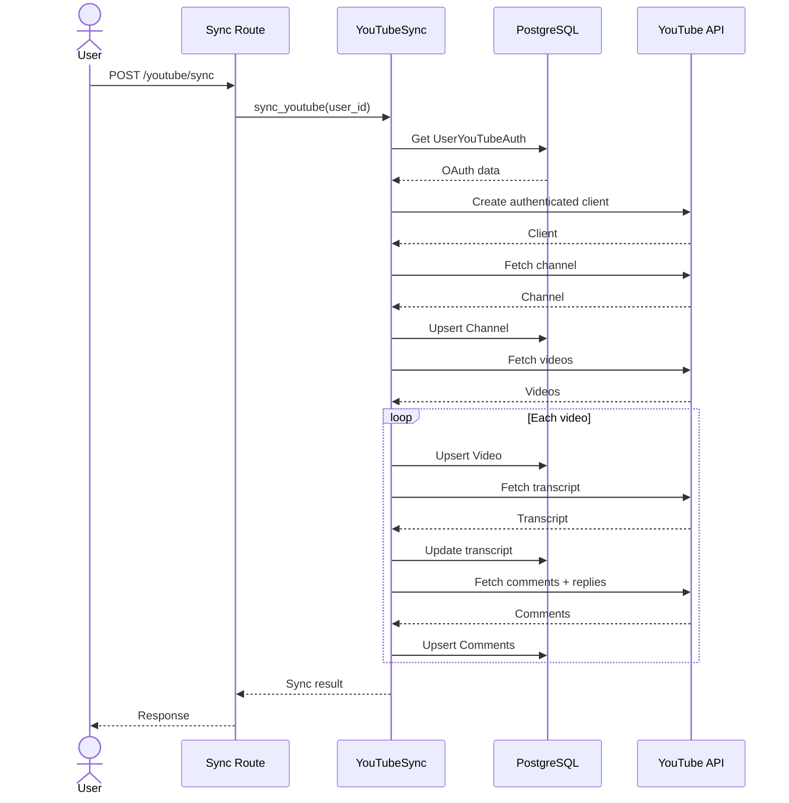
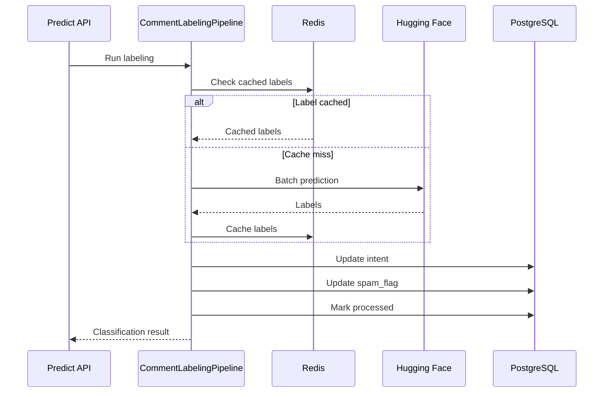
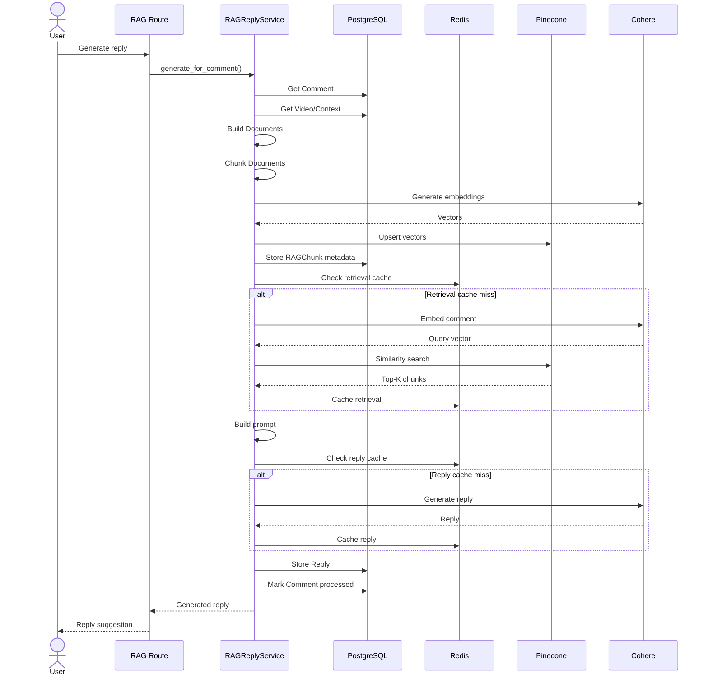
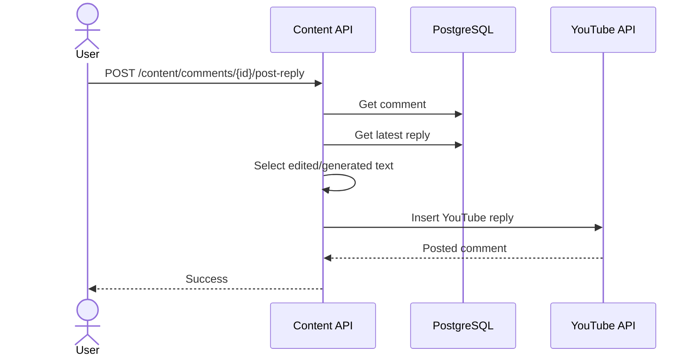
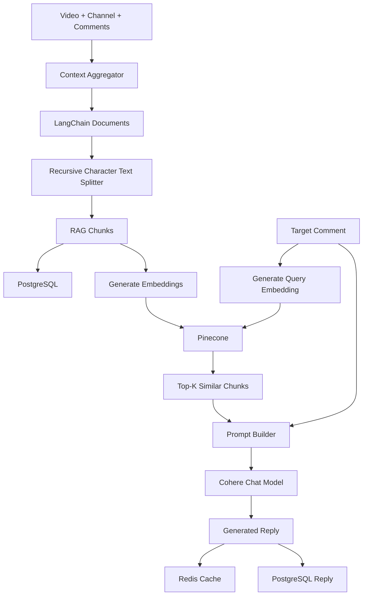

# AI YouTube Comment Reply System — LLD

> An AI-assisted backend for YouTube creators that synchronizes channel data, classifies comments, retrieves relevant context using RAG, generates reply suggestions, and supports human review before posting replies back to YouTube.

---

## Table of Contents

1. [Requirements](#1-requirements)
2. [Architecture](#2-architecture)
   - [Component Diagram](#21-component-diagram)
   - [Request Flow](#22-request-flow)
3. [Module Design](#3-module-design)
   - [API Layer](#31-api-layer)
   - [Service Layer](#32-service-layer)
   - [CRUD Layer](#33-crud-layer)
   - [YouTube Adapter](#34-youtube-adapter)
4. [Database Design](#4-database-design)
   - [ER Diagram](#41-er-diagram)
   - [Tables](#42-tables)
   - [Primary Keys and Foreign Keys](#43-primary-keys-and-foreign-keys)
   - [Indexes](#44-indexes)
   - [Constraints](#45-constraints)
   - [Corrected SQL Schema](#46-corrected-sql-schema)
5. [Class Diagram](#5-class-diagram)
6. [API Design](#6-api-design)
7. [Sequence Diagrams](#7-sequence-diagrams)
   - [Authentication](#71-authentication)
   - [YouTube Sync](#72-youtube-sync)
   - [Comment Classification](#73-comment-classification)
   - [RAG Generation](#74-rag-generation)
   - [Post Reply](#75-post-reply)
8. [RAG Architecture](#8-rag-architecture)
9. [Redis Design](#9-redis-design)
10. [External Services](#10-external-services)
11. [Error Handling](#11-error-handling)
12. [Scalability / Improvements](#12-scalability--improvements)

---

# 1. Requirements

## Functional Requirements

### Authentication

- Authenticate application users through Clerk.
- Provision users in PostgreSQL through the Clerk webhook.
- Allow a user to connect their YouTube account through Google OAuth 2.0.
- Store YouTube OAuth credentials for later API access.
- Refresh an expired YouTube access token using the refresh token.

### YouTube Synchronization

- Fetch the authenticated user's YouTube channel.
- Synchronize videos.
- Fetch video transcripts when available.
- Fetch top-level comments and their replies.
- Store synchronized data in PostgreSQL.
- Avoid duplicate records using YouTube IDs and upsert-style persistence.

### Comment Processing

- Classify comments using a Hugging Face inference endpoint.
- Process comments in batches.
- Store the predicted intent.
- Mark comments as spam when the model label is `spam`.
- Track whether a comment has already been processed.

### RAG Reply Generation

- Aggregate video, transcript, channel persona/tone, and comment-thread context.
- Convert context into LangChain documents.
- Split documents into chunks.
- Generate embeddings.
- Store/search vectors in Pinecone.
- Retrieve the most relevant chunks for a target comment.
- Generate a concise, creator-style reply using an LLM.
- Cache expensive RAG operations using Redis.
- Store the generated reply in PostgreSQL.

### Human Review and Posting

- Show generated replies to the creator.
- Allow the creator to edit a generated reply.
- Track reply status:
  - `pending`
  - `approved`
  - `rejected`
- Post the selected reply back to YouTube.

## Non-Functional Requirements

- Keep API, business logic, persistence, and external integrations separated.
- Support asynchronous external HTTP calls where applicable.
- Use caching to reduce repeated RAG/inference work.
- Handle transient Hugging Face failures using retries and exponential backoff.
- Isolate user data using `user_id` throughout the application.

---

# 2. Architecture

The backend follows a layered architecture:

```text
                         Frontend
                            |
                            | HTTP
                            v
                   +-------------------+
                   |     FastAPI       |
                   |     API Layer     |
                   +---------+---------+
                             |
                 +-----------+-----------+
                 |           |           |
                 v           v           v
              Auth/API    Content      AI/RAG
                 |           |           |
                 +-----------+-----------+
                             |
                             v
                   +-------------------+
                   |    Service Layer  |
                   |                   |
                   | YouTube Sync      |
                   | Comment Labeling  |
                   | Context Aggregator|
                   | RAG Reply Service |
                   | HF Client         |
                   +---------+---------+
                             |
              +--------------+---------------+
              |              |               |
              v              v               v
        +-----------+  +-----------+  +-------------+
        | CRUD      |  | YouTube   |  | AI Services |
        | Layer     |  | Adapter   |  |             |
        +-----+-----+  +-----------+  | HF/Cohere   |
              |                         |
              v                         v
       +-------------+           +-------------+
       | PostgreSQL  |           | Pinecone    |
       +-------------+           +-------------+
              ^
              |
       +-------------+
       |   Redis     |
       |   Cache     |
       +-------------+
```

The application registers the OAuth, sync, RAG, prediction, content, and Clerk routers from the FastAPI entry point. Database initialization happens during application startup, and the Hugging Face client is closed during shutdown.

## 2.1 Component Diagram



## 2.2 Request Flow

A normal request follows:

```text
HTTP Request
     |
     v
Router
     |
     v
Authentication / dependency
     |
     v
Service
     |
     +----> External API / AI service
     |
     v
CRUD
     |
     v
PostgreSQL
     |
     v
Response
```

The important design principle is:

> Routes handle HTTP concerns, services handle business logic, CRUD handles database persistence, and `youtube/` handles low-level YouTube API operations.

---

# 3. Module Design

## 3.1 API Layer

Location:

```text
app/api/
├── deps.py
└── routes/
    ├── oauth_routes.py
    ├── clerk_routes.py
    ├── sync_routes.py
    ├── predict_routes.py
    ├── rag_routes.py
    └── content_routes.py
```

### `oauth_routes.py`

Responsible for:

- Starting YouTube OAuth.
- Handling Google OAuth callback.
- Exchanging authorization code for tokens.
- Persisting the user's YouTube authentication information.

### `clerk_routes.py`

Responsible for:

- Receiving Clerk webhooks.
- Provisioning/updating application users.

### `sync_routes.py`

Responsible for:

- Starting full YouTube synchronization.

Main endpoint:

```text
POST /youtube/sync
```

### `predict_routes.py`

Responsible for:

```text
POST /predict
POST /batch_predict
POST /full_pipeline
```

These expose comment classification and the complete labeling pipeline.

### `rag_routes.py`

Responsible for:

```text
POST /generate/video/{video_id}
POST /generate/comment/{comment_id}
```

These trigger RAG indexing/retrieval/generation.

### `content_routes.py`

Responsible for:

```text
GET  /content/overview
GET  /content/videos/{video_id}
POST /content/videos/{video_id}/sync-comments
POST /content/comments/{comment_id}/post-reply
```

It supports browsing synchronized content, inspecting comment threads, synchronizing comments for a video, and posting replies.

### `deps.py`

`get_current_user()`:

```text
Request
  |
  +-- x-clerk-user-id header
  |
  v
Find User in PostgreSQL
  |
  +-- not found → 404
  |
  v
Current User
```

---

## 3.2 Service Layer

Location:

```text
app/services/
```

### `youtube_sync.py`

Coordinates the complete YouTube synchronization workflow.

```text
Get OAuth credentials
        |
        v
Create YouTube client
        |
        v
Fetch channel
        |
        v
Upsert channel
        |
        v
Fetch videos
        |
        v
Upsert videos
        |
        +----> Fetch transcript
        |
        +----> Fetch comments + replies
        |
        v
Persist data
```

### `comment_labeling_pipeline.py`

Responsible for:

- Loading comments.
- Flattening comment threads.
- Checking Redis cache.
- Sending uncached texts to Hugging Face.
- Batching inference requests.
- Updating `intent` and `spam_flag`.
- Marking processing results.

### `context_aggregator.py`

Builds structured context from:

```text
Channel persona
Channel tone
Video title
Video description
Video transcript
Comments
Replies
Intent
Spam flag
```

### `rag_chunking.py`

Two main steps:

```text
build_documents()
       |
       v
LangChain Documents
       |
       v
chunk_documents()
       |
       v
RecursiveCharacterTextSplitter
       |
       v
RAG chunks
```

### `rag_reply_service.py`

Main RAG orchestration service.

Responsibilities:

- Index video context.
- Retrieve relevant chunks.
- Build the generation prompt.
- Generate reply.
- Cache retrieval/generation results.
- Persist the reply.
- Mark the comment processed.

### `hf_inference_client.py`

A reusable asynchronous Hugging Face HTTP client.

It provides:

- Timeout handling.
- Retry handling.
- Exponential backoff.
- Batch prediction.
- Response validation.
- Concurrency configuration.

---

## 3.3 CRUD Layer

Location:

```text
app/crud/
├── channel.py
├── video.py
└── comment.py
```

The CRUD layer isolates database operations from business logic.

### Channel CRUD

```text
upsert_channel()
```

Checks for an existing channel and updates it; otherwise inserts a new record.

### Video CRUD

```text
upsert_video()
```

Checks the YouTube video ID/user combination and updates or inserts the record.

### Comment CRUD

```text
upsert_comment()
update_comment_intent()
```

`upsert_comment()` stores synchronized comments and identifies creator comments by comparing the comment author's channel ID with the channel's YouTube ID.

`update_comment_intent()` stores the ML label and derives:

```text
spam_flag = (intent.lower() == "spam")
```

---

## 3.4 YouTube Adapter

Location:

```text
app/youtube/
├── client.py
├── oauth.py
├── channel.py
├── videos.py
├── comments.py
└── transcript.py
```

The package abstracts Google/YouTube-specific operations away from business logic.

### `client.py`

Creates an authenticated YouTube client.

If the access token has expired:

```text
Stored refresh token
       |
       v
Google token endpoint
       |
       v
New access token
       |
       v
Update DB
       |
       v
Create YouTube client
```

### `oauth.py`

Handles:

- Authorization URL creation.
- Authorization-code exchange.
- Access-token refresh.

### `channel.py`

Fetches the authenticated user's channel.

### `videos.py`

Fetches recent videos for the channel.

### `comments.py`

Handles:

- Top-level comments.
- Replies.
- Posting replies.

### `transcript.py`

Attempts to retrieve available transcripts and gracefully handles unavailable/disabled transcripts.

---

# 4. Database Design

Database technology:

```text
PostgreSQL
     +
SQLModel ORM
```

The SQLModel classes are the source of truth for the application's schema.

## 4.1 ER Diagram



## 4.2 Tables

### 1. `user`

```text
id
email
clerk_user_id
created_at
```

Purpose:

- Represents an application user.
- `clerk_user_id` links the database user to Clerk.
- `email` is unique when present.

---

### 2. `useryoutubeauth`

```text
id
user_id
access_token
refresh_token
expiry
created_at
```

Purpose:

- Stores YouTube OAuth credentials.
- `user_id` is unique, so one user has at most one OAuth record.

Relationship:

```text
User 1 ───── 0..1 UserYouTubeAuth
```

---

### 3. `channel`

```text
id
user_id
youtube_channel_id
channel_name
description
persona
tone
created_at
```

Purpose:

- Stores synchronized YouTube channel information.
- `persona` and `tone` are later used in RAG prompt generation.

---

### 4. `video`

```text
id
user_id
channel_id
youtube_video_id
title
description
transcript
tags
created_at
```

Purpose:

- Stores synchronized videos and their context.

Relationships:

```text
User    1 ─── N Video
Channel 1 ─── N Video
```

`user_id` and `channel_id` have different purposes:

```text
video.user_id
    → Which application user owns this data?

video.channel_id
    → Which channel does this video belong to?
```

They are **not a composite primary key**.

---

### 5. `comment`

```text
id
user_id
video_id
youtube_comment_id
comment_text
parent_comment_id
author
author_channel_id
is_creator
intent
spam_flag
is_processed
created_at
```

Purpose:

- Stores YouTube comments and replies.
- Stores ML classification results.
- Tracks whether the comment has been processed.

Important:

`parent_comment_id` is the **YouTube parent comment ID**, not a foreign key to `comment.id`.

Example:

```text
YouTube comment:
youtube_comment_id = "ABC"

Reply:
parent_comment_id = "ABC"
```

---

### 6. `reply`

```text
id
user_id
comment_id
generated_reply
edited_reply
model_name
prompt_hash
source_chunk_ids
status
created_at
```

Purpose:

- Stores AI-generated reply suggestions.
- Stores human-edited version.
- Tracks approval state.
- Stores RAG source chunk IDs used for generation.

Status:

```text
pending → approved
pending → rejected
```

---

### 7. `ragchunk`

```text
id
user_id
video_id
chunk_hash
chunk_index
source_type
source_ref
text
metadata_json
is_stale
created_at
```

Purpose:

- Stores the textual RAG chunks and their metadata.
- Pinecone stores the corresponding vector embeddings.

Conceptually:

```text
                RAGChunk
                /      \
               /        \
       PostgreSQL       Pinecone
       text/metadata    embedding
```

---

## 4.3 Primary Keys and Foreign Keys

### Primary Keys

Every table uses a single surrogate primary key:

```text
user.id
useryoutubeauth.id
channel.id
video.id
comment.id
reply.id
ragchunk.id
```

The primary key answers:

> "Which row is this?"

### Foreign Keys

```text
useryoutubeauth.user_id → user.id

channel.user_id → user.id

video.user_id → user.id
video.channel_id → channel.id

comment.user_id → user.id
comment.video_id → video.id

reply.user_id → user.id
reply.comment_id → comment.id

ragchunk.user_id → user.id
ragchunk.video_id → video.id
```

A foreign key answers:

> "Which other row is this entity related to?"

### Why `video` does not use `(user_id, channel_id)` as a composite PK

One channel can contain many videos:

```text
User 1
  |
  +-- Channel 10
       |
       +-- Video 101
       +-- Video 102
       +-- Video 103
```

All three videos can have:

```text
user_id = 1
channel_id = 10
```

Therefore `(user_id, channel_id)` cannot uniquely identify a video.

The separate `video.id` uniquely identifies each video.

---

## 4.4 Indexes

The models create indexes on frequently queried/filtered columns.

Important indexes:

```text
user.email
user.clerk_user_id

useryoutubeauth.user_id

channel.user_id
channel.youtube_channel_id

video.user_id
video.channel_id
video.youtube_video_id

comment.user_id
comment.video_id
comment.youtube_comment_id
comment.parent_comment_id
comment.author_channel_id

reply.user_id
reply.comment_id
reply.prompt_hash

ragchunk.user_id
ragchunk.video_id
ragchunk.chunk_hash
ragchunk.source_type
ragchunk.source_ref
```

### Why indexes?

Typical queries include:

```sql
WHERE user_id = ?
WHERE video_id = ?
WHERE channel_id = ?
WHERE youtube_video_id = ?
WHERE youtube_comment_id = ?
```

Indexes avoid scanning the complete table for these lookups.

---

## 4.5 Constraints

Important constraints:

### Uniqueness

```text
user.email
user.clerk_user_id

channel.youtube_channel_id

video.youtube_video_id

comment.youtube_comment_id

ragchunk.chunk_hash
```

Purpose:

> Prevent duplicate application records for the same external object or logical entity.

### One YouTube auth per user

```text
useryoutubeauth.user_id UNIQUE
```

Therefore:

```text
User 1 → 0..1 YouTubeAuth
```

### Nullable fields

Examples:

```text
user.email
channel.description
channel.persona
channel.tone
video.description
video.transcript
video.tags
comment.parent_comment_id
comment.author
comment.author_channel_id
comment.intent
reply.edited_reply
reply.model_name
reply.prompt_hash
reply.source_chunk_ids
ragchunk.source_ref
ragchunk.metadata_json
```

---

## 4.6 Corrected SQL Schema

> The following is the corrected relational SQL representation of the current SQLModel schema used in the project. It intentionally does **not** add the previously discussed `reply_sources` table, does not make `parent_comment_id` a foreign key, and does not make `(user_id, channel_id)` a composite primary key.

```sql
CREATE TABLE "user" (
    id SERIAL PRIMARY KEY,
    email VARCHAR(255) UNIQUE,
    clerk_user_id VARCHAR(255) NOT NULL UNIQUE,
    created_at TIMESTAMP NOT NULL
);

CREATE TABLE useryoutubeauth (
    id SERIAL PRIMARY KEY,
    user_id INTEGER NOT NULL UNIQUE,
    access_token VARCHAR NOT NULL,
    refresh_token VARCHAR NOT NULL,
    expiry TIMESTAMP,
    created_at TIMESTAMP NOT NULL,

    CONSTRAINT fk_useryoutubeauth_user
        FOREIGN KEY (user_id)
        REFERENCES "user"(id)
);

CREATE TABLE channel (
    id SERIAL PRIMARY KEY,
    user_id INTEGER NOT NULL,
    youtube_channel_id VARCHAR(255) NOT NULL UNIQUE,
    channel_name VARCHAR(255) NOT NULL,
    description TEXT,
    persona TEXT,
    tone VARCHAR(255),
    created_at TIMESTAMP NOT NULL,

    CONSTRAINT fk_channel_user
        FOREIGN KEY (user_id)
        REFERENCES "user"(id)
);

CREATE TABLE video (
    id SERIAL PRIMARY KEY,
    user_id INTEGER NOT NULL,
    channel_id INTEGER NOT NULL,
    youtube_video_id VARCHAR(255) NOT NULL UNIQUE,
    title VARCHAR(255) NOT NULL,
    description TEXT,
    transcript TEXT,
    tags VARCHAR(255),
    created_at TIMESTAMP NOT NULL,

    CONSTRAINT fk_video_user
        FOREIGN KEY (user_id)
        REFERENCES "user"(id),

    CONSTRAINT fk_video_channel
        FOREIGN KEY (channel_id)
        REFERENCES channel(id)
);

CREATE TABLE comment (
    id SERIAL PRIMARY KEY,
    user_id INTEGER NOT NULL,
    video_id INTEGER NOT NULL,
    youtube_comment_id VARCHAR(255) NOT NULL UNIQUE,
    comment_text TEXT NOT NULL,
    parent_comment_id VARCHAR(255),
    author VARCHAR(255),
    author_channel_id VARCHAR(255),
    is_creator BOOLEAN NOT NULL DEFAULT FALSE,
    intent VARCHAR(255),
    spam_flag BOOLEAN NOT NULL DEFAULT FALSE,
    is_processed BOOLEAN NOT NULL DEFAULT FALSE,
    created_at TIMESTAMP NOT NULL,

    CONSTRAINT fk_comment_user
        FOREIGN KEY (user_id)
        REFERENCES "user"(id),

    CONSTRAINT fk_comment_video
        FOREIGN KEY (video_id)
        REFERENCES video(id)
);

CREATE TABLE reply (
    id SERIAL PRIMARY KEY,
    user_id INTEGER NOT NULL,
    comment_id INTEGER NOT NULL,
    generated_reply TEXT NOT NULL,
    edited_reply TEXT,
    model_name VARCHAR(255),
    prompt_hash VARCHAR(255),
    source_chunk_ids TEXT,
    status VARCHAR(50) NOT NULL DEFAULT 'pending',
    created_at TIMESTAMP NOT NULL,

    CONSTRAINT fk_reply_user
        FOREIGN KEY (user_id)
        REFERENCES "user"(id),

    CONSTRAINT fk_reply_comment
        FOREIGN KEY (comment_id)
        REFERENCES comment(id)
);

CREATE TABLE ragchunk (
    id SERIAL PRIMARY KEY,
    user_id INTEGER NOT NULL,
    video_id INTEGER NOT NULL,
    chunk_hash VARCHAR(255) NOT NULL UNIQUE,
    chunk_index INTEGER NOT NULL,
    source_type VARCHAR(255) NOT NULL,
    source_ref VARCHAR(255),
    text TEXT NOT NULL,
    metadata_json TEXT,
    is_stale BOOLEAN NOT NULL DEFAULT FALSE,
    created_at TIMESTAMP NOT NULL,

    CONSTRAINT fk_ragchunk_user
        FOREIGN KEY (user_id)
        REFERENCES "user"(id),

    CONSTRAINT fk_ragchunk_video
        FOREIGN KEY (video_id)
        REFERENCES video(id)
);
```

### Schema mental model

```text
USER
 |
 +---- USER_YOUTUBE_AUTH
 |
 +---- CHANNEL
 |       |
 |       +---- VIDEO
 |              |
 |              +---- COMMENT
 |              |      |
 |              |      +---- REPLY
 |              |
 |              +---- RAGCHUNK
 |
 +---- VIDEO
 +---- COMMENT
 +---- REPLY
 +---- RAGCHUNK
```

The direct `user_id` fields provide user ownership/filtering at each major entity.

---

# 5. Class Diagram

The main application components can be understood as:



---

# 6. API Design

## Root

```text
GET /
```

Returns:

```json
{
  "message": "API running"
}
```

## Authentication

| Method | Endpoint | Purpose |
|---|---|---|
| GET | `/auth/youtube` | Start YouTube OAuth |
| GET | `/auth/callback` | Handle OAuth callback |
| POST | `/webhooks/clerk` | Clerk user provisioning |

## YouTube Sync

| Method | Endpoint | Purpose |
|---|---|---|
| POST | `/youtube/sync` | Synchronize channel/videos/comments/transcripts |

## Prediction

| Method | Endpoint | Purpose |
|---|---|---|
| POST | `/predict` | Predict labels |
| POST | `/batch_predict` | Batch prediction |
| POST | `/full_pipeline` | Run complete labeling pipeline |

## RAG

| Method | Endpoint | Purpose |
|---|---|---|
| POST | `/generate/video/{video_id}` | Generate replies for video context |
| POST | `/generate/comment/{comment_id}` | Generate reply for a comment |

## Content

| Method | Endpoint | Purpose |
|---|---|---|
| GET | `/content/overview` | Channel/video/comment overview |
| GET | `/content/videos/{video_id}` | Video and threaded comments |
| POST | `/content/videos/{video_id}/sync-comments` | Sync comments for one video |
| POST | `/content/comments/{comment_id}/post-reply` | Post selected reply |

---

# 7. Sequence Diagrams

## 7.1 Authentication

### Clerk provisioning



### YouTube OAuth



---

## 7.2 YouTube Sync



---

## 7.3 Comment Classification



---

## 7.4 RAG Generation



---

## 7.5 Post Reply



The creator remains in control of the final response before it is posted.

---

# 8. RAG Architecture

The RAG system uses:

```text
LangChain
Cohere
Pinecone
Redis
PostgreSQL
```

## Context Construction

The source context contains:

```text
Channel persona
Channel tone

Video title
Video description
Video transcript

Comment threads
    ├── Parent comment
    └── Replies

Comment intent
Spam flag
```

## RAG Pipeline



## Why PostgreSQL + Pinecone?

PostgreSQL stores application data and RAG chunk metadata/text.

Pinecone is optimized for vector similarity search.

```text
PostgreSQL
    |
    +-- RAGChunk
    |     +-- text
    |     +-- chunk_hash
    |     +-- source_type
    |     +-- metadata
    |
    v
Pinecone
    |
    +-- embedding vector
    +-- retrieval metadata
```

## Chunking

`build_documents()` creates documents for:

1. Video metadata.
2. Transcript.
3. Channel persona/tone.
4. Comment threads.

`chunk_documents()` uses `RecursiveCharacterTextSplitter`.

## Prompt

The generated prompt includes:

```text
Channel persona
Preferred tone

Target comment ID
Target comment intent
Spam flag

Comment text

Retrieved context
```

The model is instructed to generate a concise, human reply and de-escalate abusive comments.

---

# 9. Redis Design

Redis is a cache, not the primary database.

The project uses a `RAGCache` abstraction.

Key format:

```text
rag:<scope>:<key>
```

Examples of logical scopes:

```text
rag:hf_label:<hash>
rag:aggregate:<scope>
rag:retrieval:<scope>
rag:reply:<hash>
```

## Cache Flow

```text
Request
   |
   v
Redis GET
   |
   +---- Hit ----> Return cached result
   |
   +---- Miss
           |
           v
       Expensive operation
           |
           v
       Redis SET + TTL
           |
           v
         Return
```

## Why Redis?

The expensive operations include:

- Hugging Face classification.
- Embedding generation.
- Pinecone retrieval.
- LLM reply generation.
- Aggregated context creation.

Caching avoids repeating identical work.

## Cache Isolation

RAG retrieval uses user/video scope.

Conceptually:

```text
rag:<scope>:<user_id>:<video_id>:<hash>
```

This helps prevent one user's cached RAG data from being returned for another user.

---

# 10. External Services

| Service | Purpose |
|---|---|
| Clerk | Application authentication/user provisioning |
| Google OAuth | YouTube account authorization |
| YouTube Data API | Channels, videos, comments, replies |
| YouTube Transcript API | Video transcripts |
| Hugging Face endpoint | Comment intent classification |
| Cohere | Embeddings and LLM reply generation |
| Pinecone | Vector storage and similarity search |
| Redis | Cache |

## External Service Flow

```text
                    Application
                        |
        +---------------+----------------+
        |               |                |
        v               v                v
     YouTube          HF/Cohere       Clerk/Google
        |               |
        v               v
   Data ingestion       AI
                        |
                        v
                    Pinecone
```

---

# 11. Error Handling

## API Layer

The API routes translate application errors into HTTP responses.

Typical categories:

```text
400 → Invalid request / missing required resource state
401 → Missing authentication information
404 → Resource not found
500 → Unexpected server error
502 → External inference/API failure
```

## Authentication Errors

Example:

```text
Missing x-clerk-user-id
        ↓
401 Unauthorized
```

Unknown user:

```text
Clerk ID not found in PostgreSQL
        ↓
404 User not found
```

## YouTube Errors

Potential failures:

- Missing YouTube authentication.
- Expired access token.
- Refresh-token failure.
- Missing channel/video.
- YouTube API request failure.
- Transcript unavailable.

The transcript adapter treats unavailable/disabled transcripts as a non-fatal condition and returns `None`.

## Hugging Face Errors

`HFInferenceClient` handles:

```text
408
429
5xx
timeouts
request errors
invalid JSON
missing data list
response-size mismatch
```

Retryable failures use exponential backoff:

```text
attempt 1 → wait
attempt 2 → wait × 2
attempt 3 → wait × 4
...
```

## RAG Errors

Examples:

```text
Comment not found
Comment belongs to another user
Comment has no linked video
Pinecone retrieval failure
Embedding failure
LLM generation failure
```

## Data Isolation

Many API/service queries verify:

```python
resource.user_id == current_user.id
```

This is important because the database contains data belonging to multiple users.

---

# 12. Scalability / Improvements

The current implementation is a functional application architecture. For larger production workloads, the following improvements would be useful.

## 12.1 Background Jobs

Currently, YouTube synchronization and parts of AI processing can be expensive.

Instead of:

```text
HTTP request
    |
    v
Sync everything
    |
    v
HTTP response
```

use:

```text
HTTP request
    |
    v
Create job
    |
    v
Queue
    |
    v
Worker
    |
    +-- YouTube sync
    +-- Comment classification
    +-- RAG indexing
```

Possible technologies:

```text
Celery / RQ / Kafka / managed queues
```

---

## 12.2 Pagination

The current YouTube adapters use fixed `maxResults` values and comments/videos are not fully paginated in the shown adapters.

Production implementation should use:

```text
nextPageToken
      |
      v
Fetch next page
      |
      v
Repeat until no nextPageToken
```

---

## 12.3 Database Migrations

The current application creates tables through:

```text
SQLModel.metadata.create_all()
```

A production system should use migration tooling such as Alembic:

```text
Model change
    |
    v
Migration
    |
    v
Database schema version
```

This allows safe incremental schema changes.

---

## 12.4 Stronger Authentication Verification

The current dependency reads:

```text
x-clerk-user-id
```

from the request.

For production, the server should verify a trusted Clerk authentication token/session rather than trusting a client-supplied identity header by itself.

---

## 12.5 Token Security

OAuth tokens are sensitive.

Production improvements:

- Encrypt refresh tokens at rest.
- Restrict database access.
- Never log access/refresh tokens.
- Rotate/revoke credentials when required.
- Avoid exposing tokens in API responses.

---

## 12.6 Better RAG Lifecycle

When video context changes:

```text
Video changed
    |
    v
Old chunks become stale
    |
    v
Re-index changed content
    |
    v
Update Pinecone vectors
```

The `is_stale` field already provides a place to track stale RAG chunks.

---

## 12.7 Database Query Optimization

At higher scale:

- Add composite indexes based on real query patterns.
- Use pagination for videos/comments.
- Avoid loading an entire video's comments into memory.
- Use bulk upserts for large synchronization jobs.
- Use connection pooling.
- Measure slow queries using PostgreSQL query plans.

---

## 12.8 Idempotent Synchronization

The current upsert design is intended to avoid duplicate synchronized objects.

The important external identifiers are:

```text
youtube_channel_id
youtube_video_id
youtube_comment_id
```

Production synchronization should make the database operation explicitly atomic and idempotent:

```text
Same YouTube object
      |
      +---- first sync → INSERT
      |
      +---- later sync → UPDATE
```

---

## 12.9 Vector Indexing Improvements

Instead of rebuilding all context every time:

```text
Video unchanged
     |
     v
Reuse existing chunks/vectors
```

Only changed content should be re-chunked and re-embedded.

`chunk_hash` can be used to detect unchanged content.

---

## 12.10 Observability

Production deployment should add:

```text
Structured logs
Metrics
Tracing
Request IDs
External API latency
LLM latency
Cache hit rate
Pinecone query latency
Database query latency
```

Useful metrics:

```text
RAG cache hit rate
HF inference success/failure rate
Average reply-generation latency
YouTube sync duration
Comments processed per minute
RAG retrieval latency
```

---

# Interview Mental Model

If asked to explain the complete system, use this order:

```text
1. User authenticates
        ↓
2. Connect YouTube using OAuth
        ↓
3. Sync channel/videos/comments/transcripts
        ↓
4. Store normalized data in PostgreSQL
        ↓
5. Classify comments using Hugging Face
        ↓
6. Build RAG context from video + comments + persona
        ↓
7. Chunk and embed context
        ↓
8. Store/search vectors in Pinecone
        ↓
9. Retrieve relevant context for target comment
        ↓
10. Generate reply using Cohere
        ↓
11. Cache expensive results in Redis
        ↓
12. Store reply in PostgreSQL
        ↓
13. Creator reviews/edits
        ↓
14. Post approved reply to YouTube
```

## Database Mental Model

```text
USER
 |
 +-- YouTubeAuth
 |
 +-- Channel
       |
       +-- Video
             |
             +-- Comment
             |     |
             |     +-- Reply
             |
             +-- RAGChunk
```

Remember:

```text
PK = identifies the row itself

FK = connects the row to another table

UNIQUE external ID = prevents duplicate external objects

PostgreSQL = relational application data

Pinecone = vector search

Redis = cache
```

---

# Source-of-Truth Notes

The LLD above is based primarily on the uploaded implementation:

- `main.py` defines FastAPI startup/lifecycle, CORS, and router registration.
- `app/db/models.py` defines the actual SQLModel entities, fields, PKs, FKs, indexes, and relationships.
- `app/db/init_db.py` initializes the SQLModel tables.
- `app/services/` contains the application business logic.
- `app/crud/` contains persistence/upsert operations.
- `app/youtube/` abstracts YouTube API operations.
- `app/api/routes/` defines the HTTP API.
- The project README describes PostgreSQL + SQLModel, YouTube, Hugging Face, LangChain/Cohere, Pinecone, Redis, Clerk, and Google OAuth as the main technologies.

> Important: The SQL in [Corrected SQL Schema](#46-corrected-sql-schema) is a clean relational representation for LLD/documentation. The application's actual schema is generated from the SQLModel definitions at startup; therefore, if the ORM models and hand-written SQL ever differ, `app/db/models.py` is the implementation source of truth.
