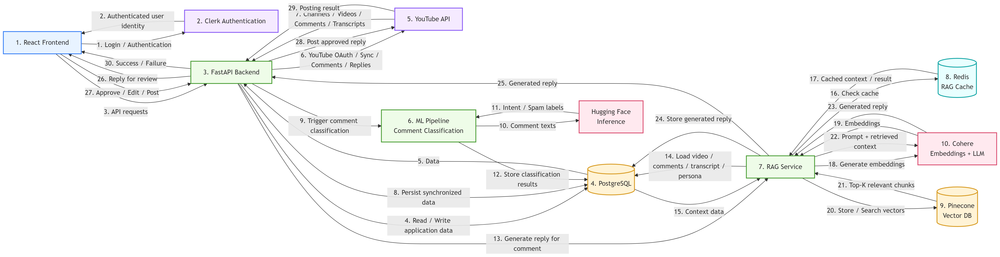

# AI-Assisted-Youtube-Comment-Reply-System

AI-assisted system for YouTube creators to sync channel content, classify comment intent, and generate context-aware replies via RAG.

## Overview

This project is a FastAPI backend that connects YouTube creators to their channel data and uses AI to manage comments.

It authenticates via YouTube OAuth, syncs videos/comments/transcripts into PostgreSQL, runs an ML labeling pipeline for intent classification, and employs a RAG pipeline (LangChain + Cohere + Pinecone) to generate relevant reply suggestions. Replies can be reviewed and posted back to YouTube.

The system targets creators who want to scale thoughtful engagement without manually reading every comment.

## Features

- YouTube OAuth 2.0 flow for secure channel access (`app/api/routes/oauth_routes.py`, `app/youtube/oauth.py`)
- Full content sync: channels, videos, transcripts, and threaded comments (`app/api/routes/sync_routes.py`, `app/services/youtube_sync.py`)
- Intent classification pipeline using Hugging Face inference (`app/services/comment_labeling_pipeline.py`, `app/api/routes/predict_routes.py`)
- RAG-based reply generation with context aggregation from video + comments (`app/api/routes/rag_routes.py`, `app/services/context_aggregator.py`, `app/services/rag_reply_service.py`)
- Content browsing and manual reply posting (`app/api/routes/content_routes.py`)
- Clerk webhook user provisioning and authentication middleware (`app/api/routes/clerk_routes.py`, `app/api/deps.py`)
- Redis-backed caching for RAG chunks and Pinecone vector storage

## High-level architecture



## Database-Schema


## Tech Stack

- **Language & Framework**: Python 3.11, FastAPI, Uvicorn
- **Database**: PostgreSQL + SQLModel (ORM)
- **YouTube**: google-api-python-client, youtube-transcript-api
- **AI / RAG**: LangChain, langchain-cohere, Pinecone, tiktoken
- **Caching / Inference**: Redis, custom HFInferenceClient with retry logic
- **Auth**: Clerk webhooks, Google OAuth2
- **Other**: httpx, python-dotenv, svix

Dependencies are declared in `pyproject.toml`.

## Getting Started

### Prerequisites

- Python 3.11+
- PostgreSQL database (Neon or local)
- Redis instance
- Pinecone index
- Cohere API key
- Hugging Face inference endpoint (optional)
- Google Cloud OAuth credentials for YouTube

### Installation

```bash
git clone <repo>
cd youtube-comment-bot
poetry install
```

### Run the server

```bash
uvicorn main:app --host 0.0.0.0 --port 8000
```

Database tables are created automatically on startup via `app/db/init_db.py`.

## Docker

A production-ready Dockerfile is provided:

```dockerfile
FROM python:3.11-slim
...
CMD ["uvicorn", "main:app", "--host", "0.0.0.0", "--port", "8000"]
```

Build and run:

```bash
docker build -t youtube-comment-bot .
docker run -p 8000:8000 --env-file .env youtube-comment-bot
```

## Configuration

All settings are loaded from environment variables in `config.py`:

- `DATABASE_URL`
- `COHERE_API_KEY`, `COHERE_CHAT_MODEL`, `COHERE_EMBED_MODEL`
- `PINECONE_API_KEY`, `PINECONE_INDEX_NAME`, `PINECONE_NAMESPACE_PREFIX`
- `REDIS_URL`, `REDIS_CACHE_TTL_SECONDS`
- `RAG_TOP_K`, `RAG_CHUNK_SIZE`, `RAG_CHUNK_OVERLAP`
- `HF_INFERENCE_URL`, `HF_TIMEOUT_SECONDS`, etc.
- `GOOGLE_CLIENT_ID`, `GOOGLE_CLIENT_SECRET`, `GOOGLE_REDIRECT_URI`
- `CLERK_WEBHOOK_SECRET`

Copy `.env.example` (if present) or create a `.env` file with the above keys.

## Project Structure

```
app/
├── api/
│   ├── routes/          # FastAPI routers (oauth, sync, rag, predict, content, clerk)
│   └── deps.py          # get_current_user, get_session dependencies
├── crud/                # Database upsert helpers for Channel, Video, Comment
├── db/
│   ├── models.py        # SQLModel tables (User, Channel, Video, Comment, Reply, RAGChunk)
│   ├── session.py       # SQLAlchemy engine with Neon-friendly pooling
│   └── init_db.py       # Table creation
├── services/
│   ├── comment_labeling_pipeline.py  # HF batch intent classification
│   ├── context_aggregator.py         # Video + comment context building
│   ├── rag_reply_service.py          # RAG retrieval + generation
│   ├── hf_inference_client.py        # Async HF endpoint client with retries
│   └── youtube_sync.py               # YouTube Data API sync logic
├── youtube/             # Low-level YouTube clients (auth, comments, transcripts, videos)
└── main.py              # FastAPI app, lifespan, CORS, router registration
```

The architecture separates concerns: API layer handles HTTP and auth, services implement AI/ML pipelines, CRUD layer manages persistence, and the YouTube package abstracts external API calls.
